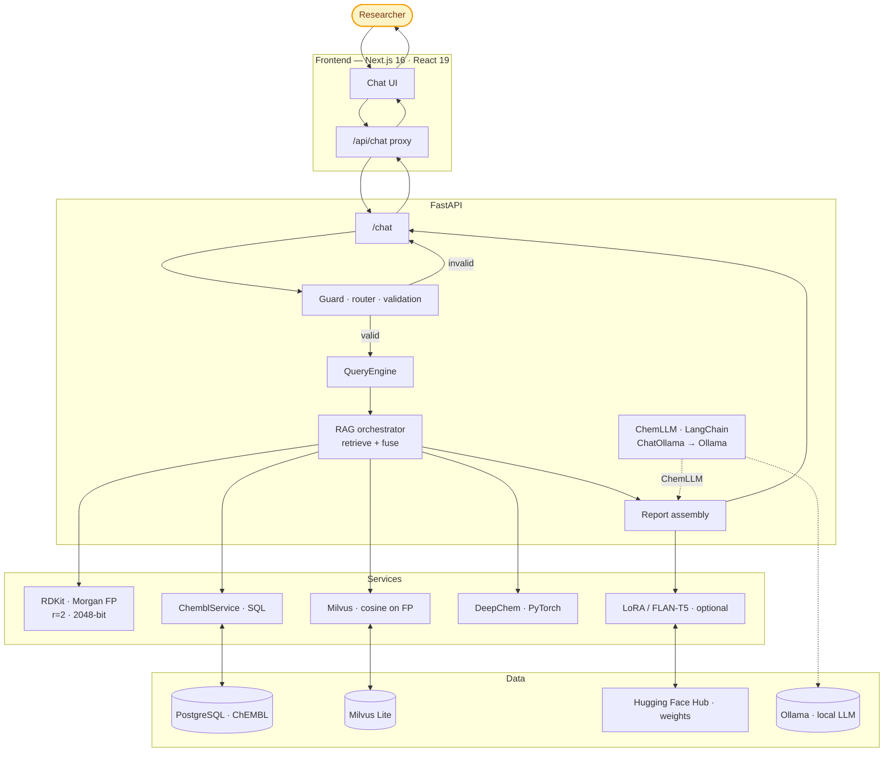

<div align="center">

# ChemSynth AI — Analysis Agent

**Agentic RAG for drug analysis** — **retrieval-augmented** pipelines over **ChEMBL** + **Milvus** (indexed with **RDKit Morgan fingerprints**, radius **2**, **2048** bits), **DeepChem** predictions, and **ChemLLM** (**LangChain** + **Ollama**) with typed JSON responses behind guardrails and routing.

Modern **FastAPI · Next.js · PostgreSQL · RAG · LangChain · Ollama · ChemLLM · RDKit · Morgan FP · Milvus · DeepChem** stack.

[](https://www.python.org/)
[](https://fastapi.tiangolo.com/)
[](https://python.langchain.com/)
[](https://ollama.com/)
[](https://python.langchain.com/docs/integrations/chat/ollama/)
[](https://www.rdkit.org/)
[](https://deepchem.io/)
[](https://nextjs.org/)
[](https://react.dev/)
[](https://www.typescriptlang.org/)
[](https://www.ebi.ac.uk/chembl/)
[](https://tailwindcss.com/)

[](https://milvus.io/)

</div>

---

## See it in action

<video src="./ChemSynthAi.mp4" controls width="100%">
  <a href="./ChemSynthAi.mp4">Download the ChemSynth AI demo video</a>
</video>

**Live:** [chemsynthai.com/chat](https://chemsynthai.com/chat) · **API docs:** [api.chemsynthai.com/docs](https://api.chemsynthai.com/docs)

---

## Scope & highlights

End-to-end analysis assistant — production-shaped wiring, not a toy demo:

- **Full-stack**: typed **FastAPI** backend + **Next.js 16** (App Router) UI with a **server-side `/api/chat` proxy** (same-origin API calls, simpler CORS at deploy time).
- **Data & SQL**: **PostgreSQL** + **psycopg v3**, parameterized SQL for ChEMBL-scale joins.
- **RAG**: retrieve structured **bioactivity evidence** from **ChEMBL**, augment with **Milvus** cosine search over **RDKit Morgan fingerprints** (radius **2**, **2048** bits) + **RDKit Tanimoto** reranking — orchestrated via **`rag_orchestrator`** / **`QueryEngine`** paths.
- **ChemLLM & Ollama** (optional **`llm`** extra): **`chemllm_client.py`** uses **LangChain** **`ChatOllama`** against a local **Ollama** server (`OLLAMA_BASE_URL`, `CHEMLLM_MODEL`), plus **`agent_tools`** and **`chem_langchain_agent`** — degrades cleanly when extras aren’t installed.
- **ML**: **DeepChem** (**PyTorch**) prediction hooks (`deepchem_predictor`), optional **Transformers + PEFT (LoRA)** narrative generation from Hugging Face–hosted weights.
- **Domain discipline**: **RDKit** SMILES validation, physicochemical descriptors, SAR helpers (e.g. scaffold clustering paths where enabled).
- **Engineering**: **Pydantic v2** response contracts (discriminated `response_type`), guard/routing layers before expensive tools, **ruff** / **pytest** in the backend toolchain.

---

## What it does

Users ask in natural language or paste **names**, **SMILES**, or **ChEMBL IDs**. The system:

- Validates and resolves input against **ChEMBL** (with synonym / fuzzy paths where implemented).
- Retrieves **RAG-backed bioactivity evidence** from **ChEMBL** (targets, potencies, assay context).
- Runs **similar-compound retrieval**: **RDKit** **Morgan fingerprints** (r=**2**, **2048** bits) → **Milvus** cosine search → **RDKit Tanimoto** reranking.
- Surfaces **DeepChem**-style predictions where the pipeline is wired for the query mode.
- Returns **structured sections** (identity, evidence, similar compounds, predictions, narrative blocks) plus guardrail responses when input or evidence doesn’t qualify.

Example outcomes:

| Input | Result |
|------|--------|
| Minor typo on a drug name | Typed **`validation_error`** + ranked suggestions — **no silent pipeline run** |
| Invalid SMILES | **`invalid_smiles` / validation_error** — stops before retrieval |
| Valid molecule, no activities | **`no_evidence`** — no fabricated biology |
| Valid molecule with data | Full **`report`** payload (+ additional typed variants for target/safety flows where routed) |

### Example prompts

Natural-language queries the assistant is designed to handle:

1. What do we know about **Aspirin**? Summarize key ChEMBL assays and potency.
2. Given **SMILES** `CC(=O)OC1=CC=CC=C1C(=O)O`, find similar compounds and known bioactivity.
3. What is the **chemical composition / formula** of **Ibuprofen**, and what are common salt forms?
4. Is there evidence that **Osimertinib** targets **EGFR**? Compare activity vs **ERBB2**.
5. For the **target** **BRD4**, list well-known ligands and their reported *K*<sub>d</sub> / IC<sub>50</sub> ranges.
6. I have **SMILES** `CN1CCN(CC1)C2=NC3=CC=CC=C3N2`. Find the top-20 most similar ChEMBL compounds (Tanimoto ≥ 0.6), then summarize **human** **biochemical** assays only.
7. For **CHEMBL941** (Imatinib), compare activity across **ABL1** vs **KIT** vs **PDGFRA**. Highlight selectivity, assay types, and any outlier measurements.
8. Starting from **Warfarin**, identify close analogs and propose a **mini-SAR**: which substitutions correlate with potency changes? Use only assays with clear units and controlled endpoints.
9. List compounds active on **JAK2** with **IC<sub>50</sub> < 50 nM** in **Homo sapiens**, and exclude cell-based assays. Provide a ranked shortlist with evidence snippets.
10. For **SMILES** `CC1=CC(=O)NC(=O)N1`, predict basic properties (LogP, TPSA, solubility proxy) and flag if predictions conflict with retrieved experimental evidence.
11. I’m targeting **GPCR** ligands for **DRD2**. Retrieve known ligands, then cluster by scaffold and summarize common functional groups and likely basicity (**pK<sub>a</sub>**) trends.
12. Given a **target** (**BRAF V600E**) and a **drug class** (type-I vs type-II inhibitors), identify representative compounds and explain which evidence supports the classification.
13. Resolve ambiguity: user typed ‘**AZD9291**’. Confirm the standardized identity (name ↔ ChEMBL ID ↔ SMILES), list synonyms, and explain any mismatches.
14. For **BRD4** ligands, compare reported values across **K<sub>d</sub>** vs **IC<sub>50</sub>** vs **K<sub>i</sub>**; normalize where possible and clearly label what cannot be normalized.
15. Find compounds with evidence for **off-target** activity on **hERG** and summarize risk signals; separate **experimental** vs **predicted** endpoints.
16. Compare **two inputs**: (1) drug name ‘**Celecoxib**’ and (2) a provided SMILES. Determine if they match; if not, explain differences and proceed with both as separate candidates.

---

## Architecture & workflow



### Request flow (short)

1. Browser calls **`/api/chat`** (Next.js route — same-origin).
2. Proxy **`POST`**s JSON to FastAPI **`/chat`**.
3. **Sanitize → classify/route → validate** before ChEMBL / RDKit / Milvus / DeepChem work.
4. **RAG pipeline**: resolve inputs → **RDKit Morgan** (r=**2**, **2048** bits) + **Milvus** cosine retrieval + **Tanimoto** rerank → **ChEMBL** evidence → **DeepChem** (**PyTorch**) predictions where routed → assemble report → optional **ChemLLM** (**LangChain** `ChatOllama` → **Ollama**), **`agent_tools`**, **`chem_langchain_agent`**, and LoRA narrative when **`llm`** / **`lora`** extras are installed.
5. Response is a **typed union** keyed by **`response_type`** (mirror in **`frontend/src/types/chat.ts`**).

---

## Technologies used

Aligned with **`backend/pyproject.toml`** and **`frontend/package.json`** — optional backend extras are grouped how the repo installs them (`chemistry`, `llm`, `ml`, `lora`).

### Backend

| Area | Stack |
|------|--------|
| API | **FastAPI**, **Uvicorn**, **Pydantic v2**, **python-dotenv**, **httpx** |
| Database | **PostgreSQL** (ChEMBL schema), **psycopg v3**, raw SQL via **`sql_loader`** |
| Data wrangling | **pandas**, **numpy** |
| Chemistry | **RDKit** — SMILES validation, physicochemical descriptors, **Morgan fingerprints** (**radius 2**, **2048** bits via `MorganGenerator`), exact **Tanimoto** reranking of Milvus hits (`rdkit_service`) |
| Vector search | **Milvus Lite** (**pymilvus**) — cosine similarity over **2048-d Morgan** embeddings (**`chemistry`** extra) |
| **RAG** | **ChEMBL** SQL + **`rag_orchestrator`** / **`QueryEngine`** — evidence fused with Milvus/RDKit similarity |
| ML | **DeepChem**, **PyTorch** — `deepchem_predictor` / graph models (**`ml`** extra) |
| Narrative (optional) | **Transformers**, **PEFT** (LoRA), **safetensors**, **accelerate** (**`lora`** extra); weights from **Hugging Face Hub** |
| ChemLLM & agents (**optional**) | **`chemllm_client.py`** (**ChemLLM**) · **LangChain** **`ChatOllama`** · **Ollama** (`OLLAMA_BASE_URL`, `CHEMLLM_MODEL`) · **`chem_langchain_agent`**, **`agent_tools`** (**`llm`** extra); graceful fallback without install |
| Quality | **ruff**, **pytest**, **pytest-asyncio** |

### Frontend

| Area | Stack |
|------|--------|
| Framework | **Next.js 16** (App Router), **React 19**, **TypeScript 5** |
| Styling | **Tailwind CSS v4**, Material-style tokens / **Material Symbols** |
| Integration | **`NEXT_PUBLIC_API_BASE_URL`** + **`src/app/api/chat/route.ts`** server proxy |

---

## Project layout

```
analysis-agent/
├── backend/app/
│   ├── agents/               # LangChain-oriented agent (`chem_langchain_agent`)
│   ├── llm/                  # ChemLLM (`chemllm_client.py`), LangChain `agent_tools`, Ollama ChatOllama
│   ├── core/orchestrator/    # QueryEngine, routers
│   ├── services/             # ChEMBL, RDKit, Milvus, RAG, DeepChem, validation, …
│   ├── schemas/              # Pydantic ChatResponse shapes
│   └── main.py               # FastAPI app, CORS, dev WebSocket echo
├── frontend/src/
│   ├── app/                  # App Router pages + api/chat proxy
│   ├── components/           # ChatPanel, tables, validation UI
│   └── types/chat.ts         # mirrors backend unions
├── backend/pyproject.toml
└── frontend/package.json
```

---

## Quick start

**Prerequisites:** Python **3.10+**, Node **≥18**, PostgreSQL with **ChEMBL**, optional **Ollama** (local LLM runtime for **ChemLLM**), and a conda env that includes **RDKit / DeepChem / PyTorch / LoRA** deps when you enable those paths (README historically uses `chemdev_clean`).

### Backend

```bash
cd backend
conda activate chemdev_clean   # or your env with chemistry + ML stacks
cp .env.example .env             # edit DB_* and paths
KMP_DUPLICATE_LIB_OK=TRUE uvicorn app.main:app --reload --host 0.0.0.0 --port 8000
```

- **Production API docs:** [api.chemsynthai.com/docs](https://api.chemsynthai.com/docs)  
- **Local Swagger:** `http://127.0.0.1:8000/docs` when running Uvicorn on port 8000  

`KMP_DUPLICATE_LIB_OK=TRUE` avoids macOS **OpenMP / libomp** clashes between **RDKit** and **DeepChem**.

### Frontend

```bash
cd frontend
npm install
# Production-style API URL:
echo 'NEXT_PUBLIC_API_BASE_URL=https://api.chemsynthai.com' > .env.local
# Local backend:
# echo 'NEXT_PUBLIC_API_BASE_URL=http://127.0.0.1:8000' > .env.local
npm run dev
```

Dev UI: `http://127.0.0.1:3000` · Production chat: [chemsynthai.com/chat](https://chemsynthai.com/chat) · Deep-link example: `https://chemsynthai.com/chat?message=Aspirin`

---

## Configuration snippets

### `backend/.env` (representative)

```ini
DB_NAME=chembl_db
DB_USER=postgres
DB_PASSWORD=
DB_HOST=localhost
DB_PORT=5432

MILVUS_DB_PATH=./data/milvus_lite.db
MILVUS_COLLECTION=chembl_morgan_2048

OLLAMA_BASE_URL=http://localhost:11434
# Local Ollama runtime — serves models for ChemLLM (LangChain ChatOllama)
CHEMLLM_MODEL=chemllm:latest

DEEPCHEM_CACHE_DIR=./data/deepchem_cache
CORS_ORIGINS=https://chemsynthai.com,http://localhost:3000
LOG_LEVEL=INFO
```

### `frontend/.env.local`

```ini
NEXT_PUBLIC_API_BASE_URL=https://api.chemsynthai.com
```

---

## Design principles

- **Validate and route early** — cheap gates before PostgreSQL-heavy queries, vector search, and ML.
- **Typed contracts** — frontend and backend share discriminated **`response_type`** payloads.
- **No science without evidence** — empty ChEMBL evidence surfaces **`no_evidence`**, not hallucinated assays.

---

## API overview

**`POST /chat`** returns JSON discriminated by **`response_type`** (e.g. **`report`**, **`validation_error`**, **`no_evidence`**, plus target/safety-shaped responses where the router selects those paths). Open **`/docs`** for the live schema.

Example — successful report envelope:

```json
{
  "response_type": "report",
  "report": {
    "query": "Aspirin",
    "molecule": { "chembl_id": "CHEMBL25", "canonical_smiles": "CC(=O)Oc1ccccc1C(=O)O" },
    "similar_compounds": [],
    "evidence_summary": {},
    "experiment_list": [],
    "predictions": [],
    "report_sections": {},
    "metadata": { "model_version": "v2", "pipeline": "chem-rag-v2" }
  }
}
```

---

## License & disclaimer

Research / portfolio use only — **not medical advice**. Computational predictions require experimental validation. ChEMBL © EMBL-EBI — [CC-BY-SA 3.0](https://creativecommons.org/licenses/by-sa/3.0/).
